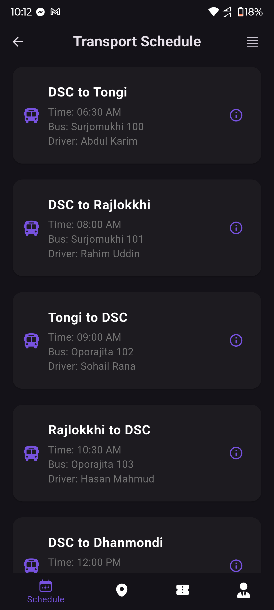
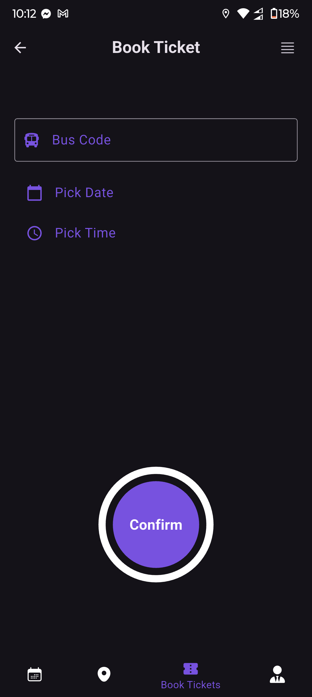
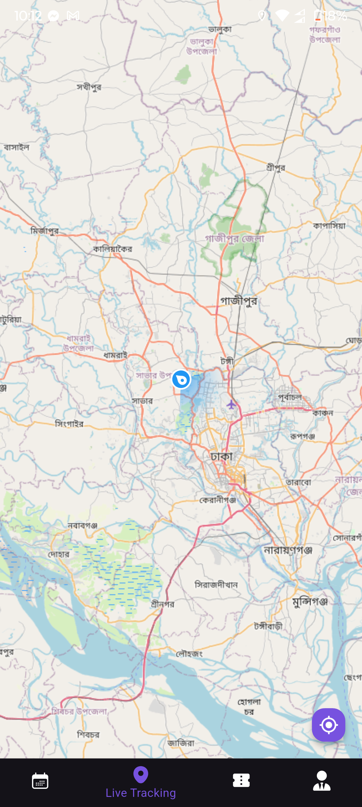
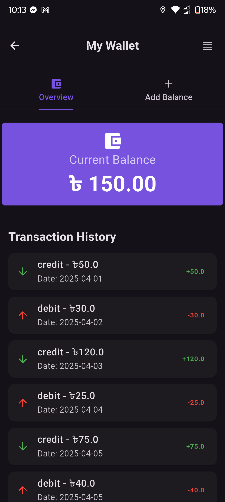

# RouteRadar 🚍

**RouteRadar** is a Flutter-based mobile application designed to streamline and enhance campus transportation management. Offering a suite of user-friendly features, it simplifies scheduling, booking, tracking, and more for students and staff. 🌟

---

## Features ✨

- **🔒 User Authentication**  
  Sign up, log in, and manage your profile securely.

- **🚌 Transport Services**  
  - View real-time transport schedules.  
  - Book tickets & request rides.  
  - Track vehicles on live maps.  

- **📚 Information Hub**  
  - Check routes and fare details.  
  - Access driver information and service updates.  

- **🆘 Support & Safety**  
  - Emergency contacts.  
  - Lost and found section.  
  - Feedback/complaint submission form.  

- **💰 In-App Wallet**  
  - View balance and transaction history.  
  - Add funds securely via integrated payment methods.  

- **👤 Profile & Settings**  
  - Update personal details.  
  - Change profile picture.  
  - Secure logout.  

---

## Screenshots 📸

| | | |
|:-------------------------:|:-------------------------:|:-------------------------:|
|  |  |  |
| **Login Screen** | **Home Dashboard** | **Ride Booking** |
|  |  |  |
| **Real-Time Tracking** | **Wallet Management** | **User Profile** |


---

## Demo Video 🎥  
([https://youtube.com/shorts/auQmYx2tscA?feature=share])

---

## Download APK 📲  
[Download Latest Release](https://github.com/yourusername/RouteRadar/releases/latest/download/app-release.apk)  

---

## Project Report 📄  
[View Full Report]([https://drive.google.com/file/d/1d7FGWOGPQW2nrZADiGciF6J-F3xW8Wmi/view?usp=sharing]) 

---

## Installation 🛠️  
1. Ensure Flutter SDK is installed.  
2. Clone the repository:  
   ```bash
   [git clone https://github.com/DIP-SARKER/routeradar.git]

3. Install dependencies:
    ```bash
    [flutter pub get]

4. Run the app:
    ```bash
    [flutter run]
